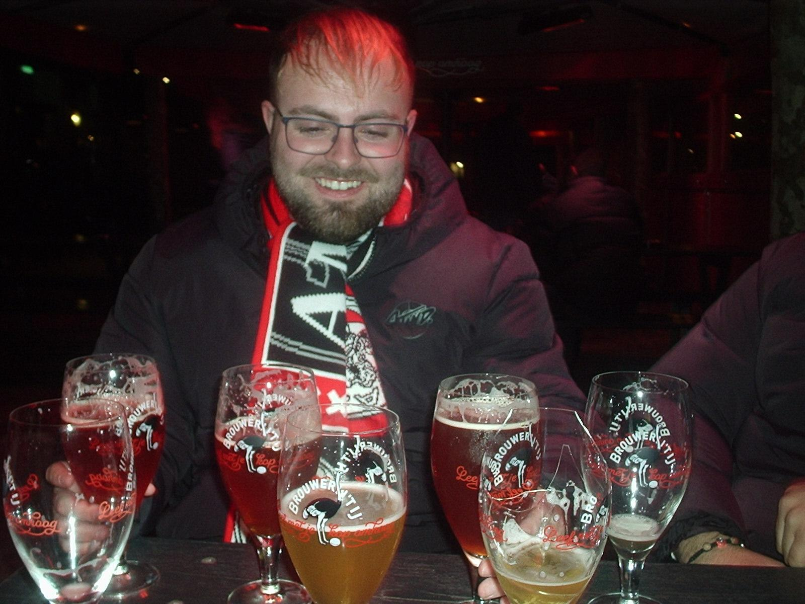

# Proyecto Storytelling: 
### Grupo 5: Simios
Plantilla para crear mi historia interactiva de la asignatura [Creatividad e innovación Audiovisual](https://www.ugr.es/estudiantes/grados/grado-comunicacion-audiovisual/creacion-difusion-nuevos-contenidos-audiovis), repositorio de proyectos y documentación en https://github.com/mgea/storytelling

Autores:  
<!---
Incluir lista de personas del grupo 
Se puede añadir enlace a página personal de github o lo que se quiera...(optativo)
-->

- 🐵: Darío González
- 🐵: Jairo Coca
- 🐵: Rodrigo Bogadanov
- 🐵: Kai Zeller

Proyecto (código): 
URL (link) del proyecto en Github: https://github.com/dariopaezugr/my_storytelling

Tipo/Género:  
- [ ] FictionCiberpunk  
- [x] Reality/tribus urbanas  
- [ ] Comic

## Resumen
Jairo es un chico de 30 años que vive en Motril agobiado con sus padres.  Quiere viajar por el mundo, pero sus padres no quieren pagarle los caprichos, instándole a trabajar. Como toda la vida ha sido un vago, está decidido a ganar dinero rápido cueste lo que cueste, y pronto no dudará en meterse al delicado mundo del narcotráfico donde tendrá una transformación de personaje al arriesgarse a grandes peligros.

### Personaje

Nombre: Jairo

NOTA: La ficha del personaje se puede hacer con la pizarra online https://excalidraw.com/ y la plantilla que se tiene en este repositorio llamada [ficha_personaje.excalidraw](ficha_personaje.excalidraw)    
* hay que descargarla al ordenado y usarla en excalidraw con la opción archivo > Abrir

### Historia
Jairo tenía treinta años y seguía viviendo en el mismo piso de siempre, en Motril, en la habitación donde aún colgaban los pósteres de cuando era adolescente. Cada mañana se despertaba tarde, escuchando el ruido de su padre preparando el café en la cocina y a su madre quejarse en voz baja, creyendo que él no oía nada.

—Con treinta años ya podría espabilar… —decía ella casi todos los días.
—Que se busque un trabajo de una vez —respondía su padre, más seco.

Jairo fingía que no le importaba, pero por dentro sentía una mezcla de rabia y frustración. Él no quería trabajar en el invernadero como su padre ni en el supermercado como su madre. Él quería viajar, ver el mundo, salir de Motril, conocer playas lejanas, ciudades enormes, noches sin horarios.

Una noche, después de otra discusión en la cena, explotó.

—¡Yo no nací para quedarme aquí toda la vida! —gritó—. Quiero dinero, quiero viajar, quiero vivir.

Su padre dejó el tenedor sobre el plato.

—Pues gáñatelo. Aquí no vamos a pagarte los caprichos.

Ese fue el momento en que algo cambió en la cabeza de Jairo.

Si quería dinero rápido, tendría que buscarlo por su cuenta.

### TagLine
Nadie le enseñó a trabajar, el mundo le obligó a sobrevivir.
### Conflicto 
Un treintañero acostumbrado a ser un nini se tendrá que enfrentar a un mundo desconocido de crimen organizado y narcotráfico. No tiene ni idea. Sólo juega al Lol. Nunca ha salido de Motril. Pero sus ganas de ver mundo lo empujarán a hacer cosas que nunca imaginaría hacer...

### Productos

- Personaje: (img personaje y enlace a interactivo) 

- Banner/Teaser:  (enlace) 

- Storytelling: (enlace) 

### Conclusiones/Valoración del equipo

------

<!---
Lista completa de emojis de markDown - https://gist.github.com/rxaviers/7360908) 
-->

Marzo, 2026

Proyecto dentro de la serie [Narrativas interactivas](https://github.com/mgea/storytelling/blob/master/What_is_a_digital_storytelling.md) 
Proyectos seleccionados de [2023](https://github.com/mgea/storytelling/tree/master/2023), [2022](https://github.com/mgea/storytelling/blob/master/2022/readme.md) / [2021](https://github.com/mgea/storytelling/blob/master/2021/readme.md) / [2020](https://github.com/mgea/storytelling/blob/master/2020/readme.md)  / 
[2019](https://github.com/mgea/storytelling/blob/master/2019/readme.md) / [2018](https://github.com/mgea/storytelling/blob/master/2018/readme.md) 

CC BYNCSA [Creatividad e Innovación Audiovisual-B](https://github.com/mgea/criav/)

 

[Facultad de Comunicación y Documentación](http://fcd.ugr.es)

Universidad de Granada
